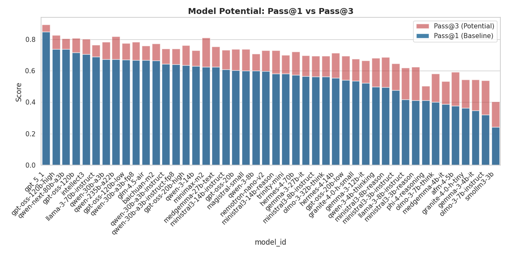

# Medical AI Performance Analysis

All the following experiments were done using the [Inference Results](https://huggingface.co/datasets/bwarner/inference-scratch) from the [MedARC Benchmarking Suite](https://github.com/MedARC-AI/med-lm-envs)

## 1. Dynamics: Thinking Length & Failure
**Script:** `scripts/thinking_length.py`

Investigates if models "overthink" (generate excessive tokens) when they fail questions.

## 2. Robustness: Distractor Stress Test
**Script:** `scripts/distractor_test_2.py`

Measures performance degradation when an extra distractor option is added (4 vs. 5 options).

## 3. Potential: Pass@k Analysis
**Script:** `scripts/pass_at_k.py`

Compares baseline single-shot accuracy (Pass@1) against theoretical maximum potential (Pass@k) given multiple attempts.

## 4. Audit: Signal vs. Noise
**Script:** `scripts/SNR.py`

Audits datasets for stability. Identifies "Lottery Zones" (high variance, low skill) versus reliable benchmarks.

## 5. Audit: Positional Bias
**Script:** `scripts/option_a_bias.py`

Checks for statistical preference for specific option letters (A-E) regardless of the correct answer.

