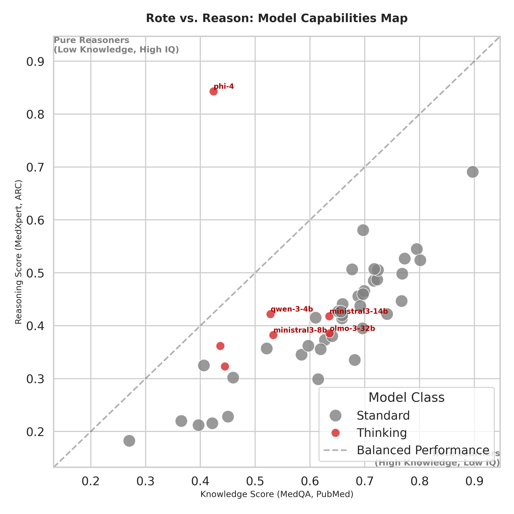
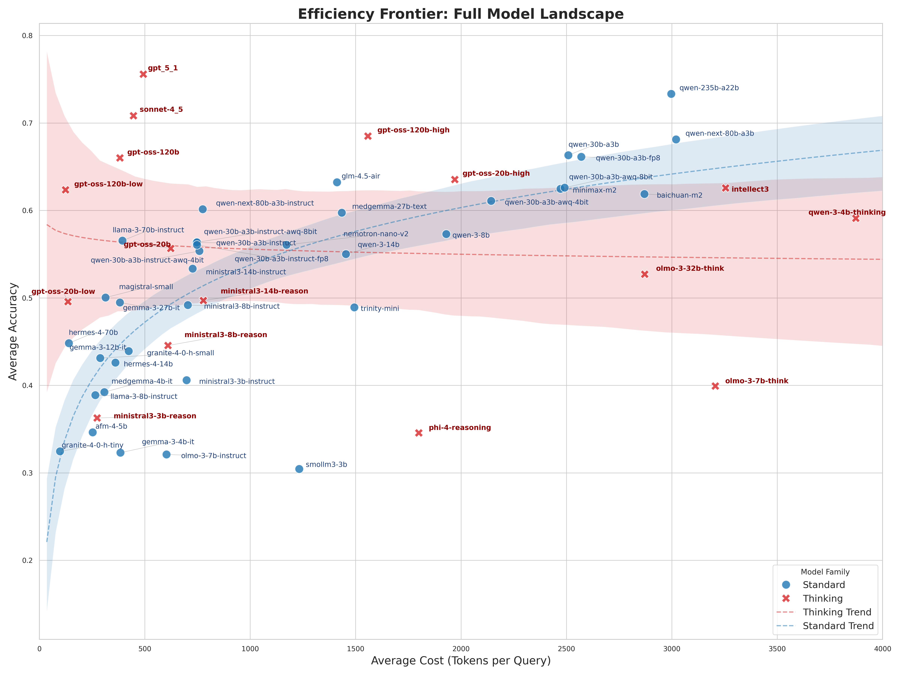
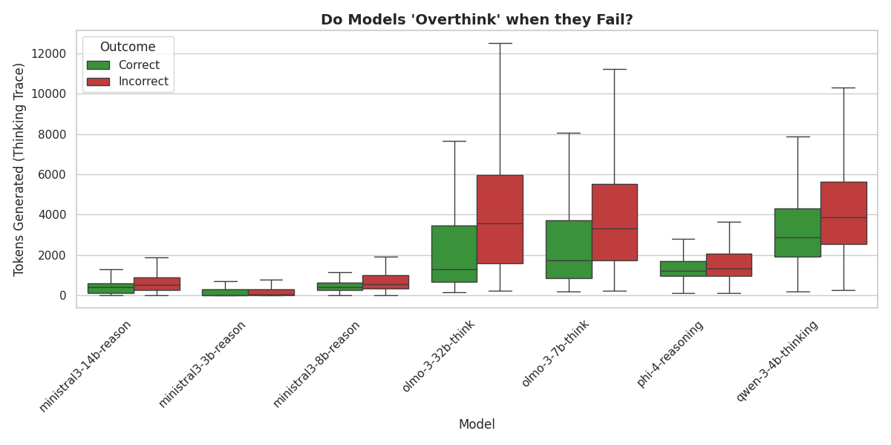
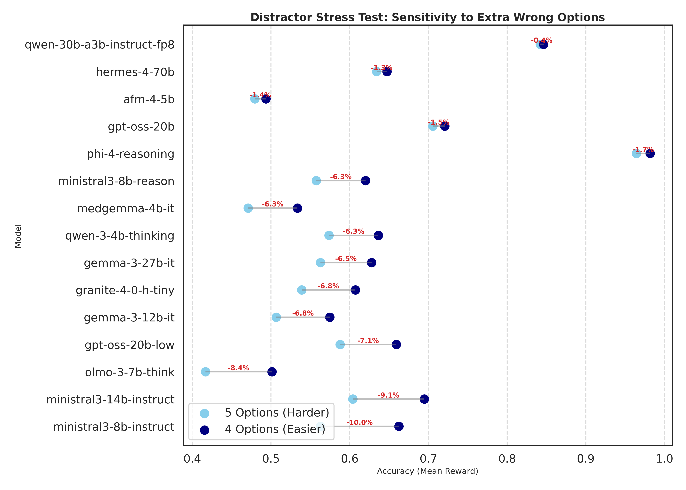
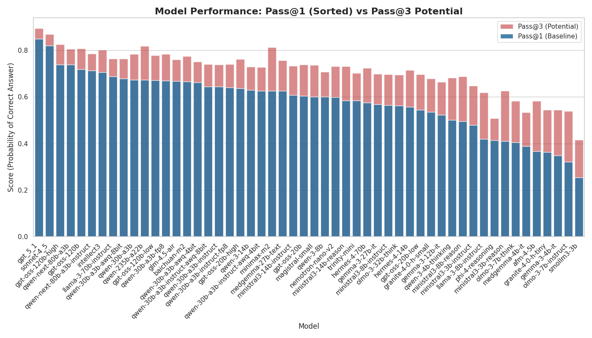
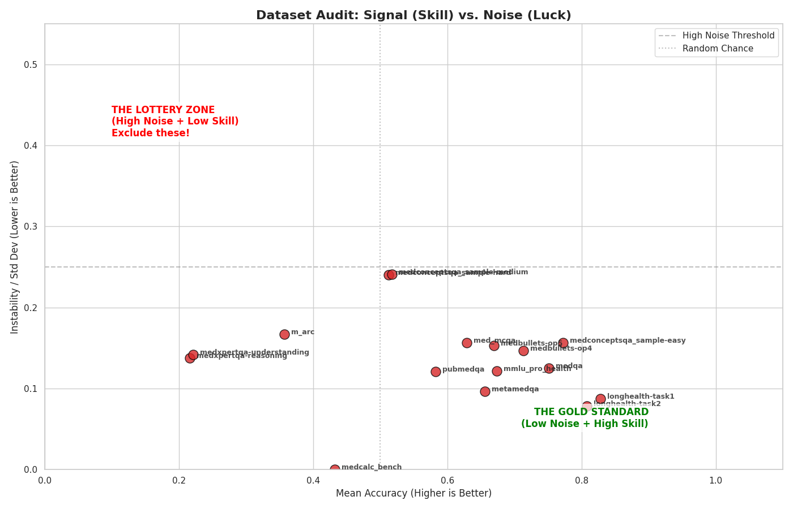

# Medical AI Performance Analysis

All the following experiments were done using the [Inference Results](https://huggingface.co/datasets/bwarner/inference-scratch) from the [MedARC Benchmarking Suite](https://github.com/MedARC-AI/med-lm-envs)

## 1. Capabilities: Rote vs. Reasoning
**Script:** `scripts/rote_vs_reason.py`

Maps models based on factual recall (MedQA, PubMed) vs. complex reasoning (MedXpert, ARC). Distinguishes "Rote Learners" from "Pure Reasoners".

## 2. Efficiency: The Thinking Tax
**Script:** `scripts/thinking_tax.py`

Analyzes the cost-benefit ratio of inference compute. Determines if higher token counts correlate with meaningful accuracy gains.

## 3. Dynamics: Thinking Length & Failure
**Script:** `scripts/thinking_length.py`

Investigates if models "overthink" (generate excessive tokens) when they fail questions.

## 4. Robustness: Distractor Stress Test
**Script:** `scripts/distractor_test.py`

Measures performance degradation when an extra distractor option is added (4 vs. 5 options).

## 3. Potential: Pass@k Analysis
**Script:** `scripts/pass_at_k.py`

Compares baseline single-shot accuracy (Pass@1) against theoretical maximum potential (Pass@k) given multiple attempts.
     

## 4. Audit: Signal vs. Noise
**Script:** `scripts/SNR.py`

Audits datasets for stability. Identifies "Lottery Zones" (high variance, low skill) versus reliable benchmarks.

